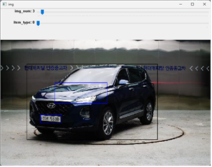

# 데이터 설명서

## 목차

- [데이터 설명서](#데이터-설명서)
  - [목차](#목차)
  - [문서 버전](#문서-버전)
  - [소개](#소개)
  - [데이터 수집(Annotation)](#데이터-수집annotation)
    - [데이터 수집 규칙](#데이터-수집-규칙)
    - [레이블러 정보](#레이블러-정보)
  - [레이블링 판독 기간](#레이블링-판독-기간)
  - [데이터 통계](#데이터-통계)
    - [전체 데이터 상세](#전체-데이터-상세)
  - [데이터 형태](#데이터-형태)
    - [출력물 설명](#출력물-설명)
    - [json 파일 설명](#json-파일-설명)

---

## 문서 버전

|버전|날짜|변경 사항|작성자|
|-|-|-|-|
|1.0.0|2023/04/27|프로젝트 시작|이병률|

---

## 소개

 이 자료는 차량, 차량번호 객체 인식 AI 데이터셋 정보를 정의하기 위해 작성되었습니다.  

---

## 데이터 수집(Annotation)

### 데이터 수집 규칙

- 데이터의 레이블은 영상별 차량과 차량번호를 기록함과 동시에 각각의 위치 정보를 포함함
- 하단 정보는 레이블러의 데이터 수집 과정을 나타냄  
  
  1. 사진을 선택함
  2. 차량 또는 챠량번호를 선택함
  3. 객체 위치를 마우스로 설정함

### 레이블러 정보

- 개발자가 직접 소량에 데이터를 수집함

## 레이블링 판독 기간

- 개인 프로젝트임으로 임의의 판독자가 없음
- 하지만, 차량과 차량번호를 인식하면 되는 간단한 테스크 임으로 별도의 판독이 불필요하다고 판단됨
- 기간별 판독 이슈는 존재하지 않음

|판독자|기간|내용|설명|
|-|-|-|-|

---

## 데이터 통계

- 실제 수집된 데이터 현황은 다음과 같음

### 전체 데이터 상세

1. 다나와 자동차
   - 데이터 수
     - 수집된 데이터 수: 60
     - 크롭한 차량 영상 수: 5
     - 크롭한 차량번호 영상 수: 4
   - 데이터 구성
     - 다양한 종류에 차량 형태

---

## 데이터 형태

Code : X

<!-- 첨부된 코드 실행 시 산출되는 데이터는 다음과 같은 구조를 가짐 -->
첨부된 코드가 없음으로 만들어진 데이터를 기준으로 설명함

<!-- 변수 설명 -->
### 출력물 설명

- crawling : 수집된 데이터를 모아둠
- car : 차량과 관련된 데이터가 저장되는 폴더
- carNumber : 차량번호와 관련된 데이터가 저장되는 폴더
- */crop : 크롭되어 짤린 영상을 저장하는 폴더
- */msk : 크롭되어 짤린 마스크를 저장하는 폴더
- json : 각 관계성이 json으로 저장되는 폴더
- 출력 트리(예제)  

  ```bash
  .
  ├── car
  │   ├── crop
  │       ├── 20230426142935483827_0.jpg
  │   │   └── 20230426142935678363_0.jpg
  │   └── msk
  │       ├── 20230426142935483827_0.jpg
  │       └── 20230426142935678363_0.jpg
  ├── carNumber
  │   ├── crop
  │   │   └── 20230426142935483827_1.jpg
  │   └── msk
  │   │   └── 20230426142935483827_1.jpg
  ├── crawling
  │   ├── img_crawling_20230426142935483827.jpg
  │   └── img_crawling_20230426142935678363.jpg
  └── json
      ├── 20230426142935483827.json
      └── 20230426142935678363.json

  8 directories
  ```

- json 내부 폴더 예제

  ```json
  {
      "result": true,
      "data": [
          {
              "x1": 72,
              "x2": 430,
              "y1": 62,
              "y2": 256,
              "type": 0,
              "id": 0
          },
          {
              "x1": 109,
              "x2": 167,
              "y1": 192,
              "y2": 213,
              "type": 1,
              "id": 1
          }
      ]
  }
  ```

### json 파일 설명

|변수|정의|비고|
|-|-|-|
|result|파일 존재 유무|true = 차량 있음, false = 차량 없음|
|data|객체모음|
|x1,y1|좌상단 위치 정보|0 ~ 이미지 최대 크기|
|x2,y2|우하단 위치 정보|0 ~ 이미지 최대 크기|
|type|객체의 종류|0 = 차량, 1 = 차량번호|
|id|영상내 객체 구분 id|0 ~ |
